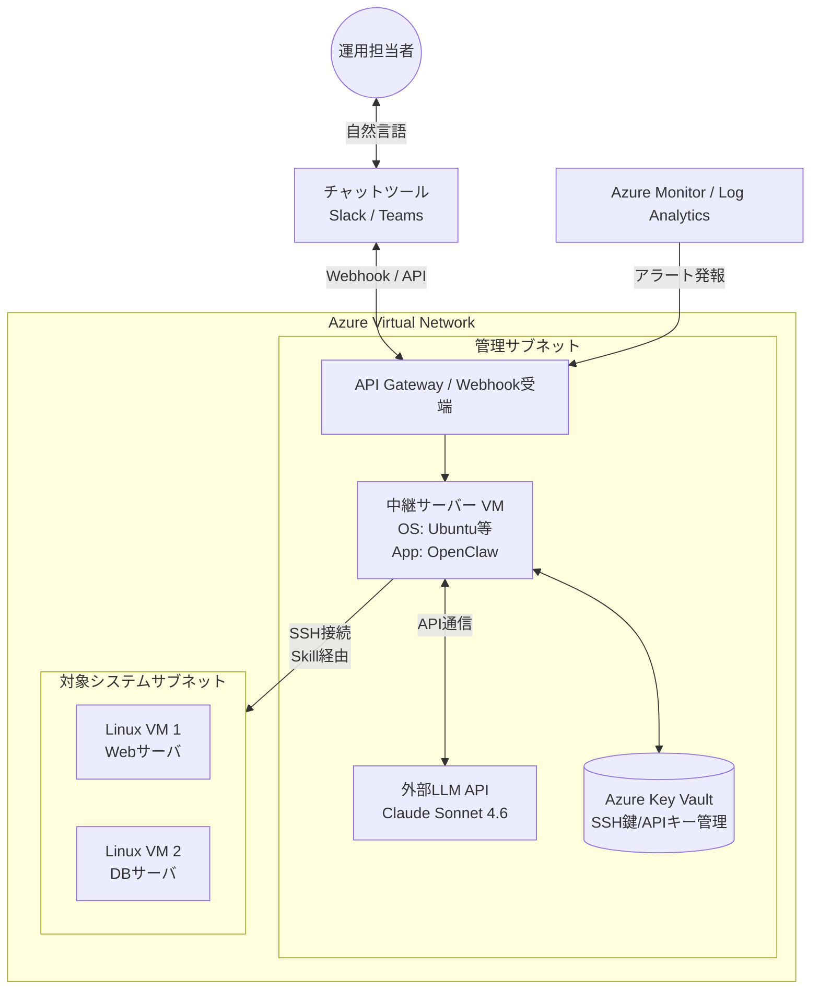

# 熟練Linuxエンジニア育成（AIエージェント化）プロジェクト 要件定義書

## 1. プロジェクト概要
### 1.1 背景と目的
社内のLinuxエンジニア育成指示に対し、高度なAgent AI技術（OpenClaw × Claude Sonnet 4.6）を活用し、熟練エンジニアと同等のトラブルシューティングや運用操作を自然言語で実行できる「AIエージェント」を構築する。これにより、**Linuxサーバの運用体制に係る人的コストの削減と対応の迅速化・標準化を図る。**

### 1.2 対象範囲（スコープ）
* **対象環境:** Microsoft Azure上の仮想ネットワーク（VNet）内に構築されたLinux仮想マシン（VM）群。
* **対象業務:** チャットツール経由でのシステム状態照会、ログ調査、プロセス再起動などの定常運用および一次障害対応。
* **対象外:** アプリケーションのコード修正、OSのメジャーバージョンアップ、物理インフラの保守。

### 1.3 段階的導入計画（ロードマップ）
* **Phase 1 (Read-Only):** 状況把握と提案アシスタント（参照系コマンドのみ許可）
* **Phase 2 (Human-in-the-Loop):** 承認制の操作実行エージェント（更新系コマンドは人間が承認）
* **Phase 3 (Autonomous):** 自律型トラブルシューティング（監視アラートを契機とした完全自律実行）

---

## 2. システム全体構成
本システムはAzure環境上に構築する。セキュリティを担保するため、外部APIやチャットツールと通信する「管理用中継サーバー（Bastion VM）」にOpenClawを配置し、閉域網（プライベートサブネット）にある各LinuxサーバーへSSH接続を行うハブ＆スポーク型の構成とする。

### 2.1 アーキテクチャ図（Azure環境）

## 3. 業務要件
### 3.1 現行業務と課題 (As-Is)
* 障害発生時、エンジニアが手動でVPN接続や踏み台サーバーを経由して各VMにログインし、調査を行っている。

* 属人化が進行しており、担当者のスキルレベルによって復旧時間（MTTR）にばらつきがある。

### 3.2 構築後の業務 (To-Be)
* エンジニアはチャットツール上でAIエージェントに症状を伝えるだけで、AIが自律的に対象VMへログインし、ログ収集や原因特定を行う。

* 解決策の提案および承認（Approve）プロセスがチャット上で完結し、操作ログも自動的に記録される。

## 4. 機能要件
本システムが備えるべき具体的な機能を以下に定義する。

### 4.1 インターフェース機能 (Gateway)
* **チャット連携**: 指定のチャットツール（Slack/Teams等）からメンションを受け取り、自然言語で応答する機能。

* **アラート受信**: Azure Monitor等からのWebhookを受信し、自律的な調査プロセスのトリガーとする機能。

### 4.2 AIエージェント中枢機能 (OpenClaw / LLM)
* **意図解釈とタスク分割**: Claude Sonnet 4.6を用いて、ユーザーの曖昧な指示を具体的なLinuxコマンドの実行計画に分割する機能。

* **自律的リトライ（Reflection）**: コマンド実行結果がエラー（例: Permission denied や Command not found）だった場合、出力を自己解析し、代替コマンドを再実行するループ機能。

* **コンテキスト保持 (Memory)**: 対話の履歴や、直前に実行したコマンドの結果をセッション中は保持し、文脈を理解した応答を行う機能。

## 4.3 実行機能 (Skills)
* **SSHコマンド実行**: OpenClawから対象のAzure Linux VMに対し、SSH経由でBashコマンドを非同期実行し、標準出力/標準エラー出力を取得する機能。

* **ファイル操作**: ログファイルの特定の行の抽出（grep, sed）、設定ファイルのバックアップ作成・追記を行う機能。

### 4.4 安全制御機能 (Guardrails)
* **Human-in-the-Loop (HITL)**: OSの再起動や設定ファイルの書き換えなど、システムに影響を与える「更新系コマンド」の実行前に、チャット上でユーザーに [Approve] / [Reject] を求める機能。

* **コマンドフィルタリング**: 事前に定義されたブラックリスト（例: rm -rf, mkfs 等）に該当するコマンド生成を強制的にブロックし、エラーを返す機能。

## 5. 非機能要件
IPAの非機能要求グレードなどを参考に、システムの品質要件を定義する。

### 5.1 可用性 (Availability)

* **API障害時のフェールセーフ**: LLM API（Claude）への通信障害やレートリミット超過時は、チャット上に明確なエラーメッセージを通知し、処理を安全に中断すること。

### 5.2 性能・拡張性 (Performance & Scalability)
* **応答時間**: ユーザーの指示から最初のレスポンス（「調査を開始します」等）まで5秒以内。コマンド実行結果の返答は、実際のOS処理時間に依存するが、タイムアウト値を設ける（例: 1コマンド最大60秒）。

* **対象VMの拡張**: 今後Azure上の対象Linux VMが増加した場合でも、インベントリ情報の追加のみでAIエージェントが操作対象として認識できること。

### 5.3 セキュリティ (Security)
* **ネットワーク制御 (NSG)**: 中継サーバー（OpenClaw VM）へのインバウンド通信は社内IP（または特定のGateway）に限定。対象Linux VMへのSSH（ポート22）は、中継サーバーからの通信のみをAzure Network Security Group (NSG) で許可する。

* **シークレット管理**: LLMのAPIキー、チャットツールのトークン、対象VMへのSSH秘密鍵は、設定ファイルに平文で記載せず、Azure Key Vault等を利用してセキュアに管理・参照すること。

* **最小権限の原則**: AIが使用するSSHアカウントは root ではなく専用の一般ユーザーとし、sudo 可能なコマンドを visudo で厳格に制限（ホワイトリスト化）する。

### 5.4 運用・保守性 (Maintainability & Operations)
* **監査ログ (Audit Trail)**: 「いつ」「誰の指示で」「AIが何のコマンドを考え」「対象VMで何が実行され」「結果がどうだったか」の一連のトランザクションをログファイル（またはLog Analytics）に永続化し、後日監査可能にすること。

* **プロンプト/Skillの更新**: AIの振る舞いを定義するシステムプロンプトやSkillの設定ファイルは、Git等のバージョン管理システムで管理し、変更履歴を追跡可能にすること。

## 6. 前提条件・制約事項
* 外部LLM API（Claude Sonnet 4.6）の利用にあたり、社内のセキュリティポリシー上、機密情報（顧客の個人情報等）がログや出力結果に含まれる場合はマスキング等の処置を検討する必要がある。

* 推論精度はLLMの性能に依存するため、100%の正確性を保証するものではなく、最終的な責任は承認を行う人間のエンジニアが負うものとする。