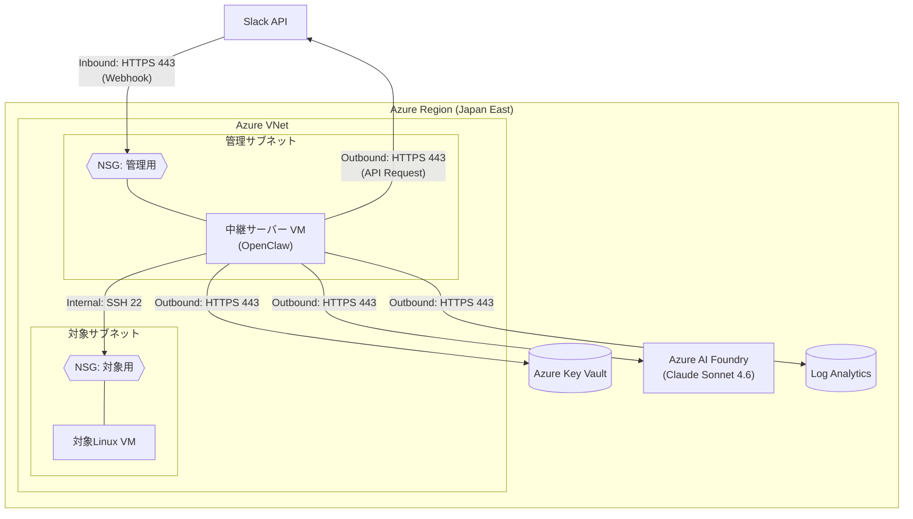
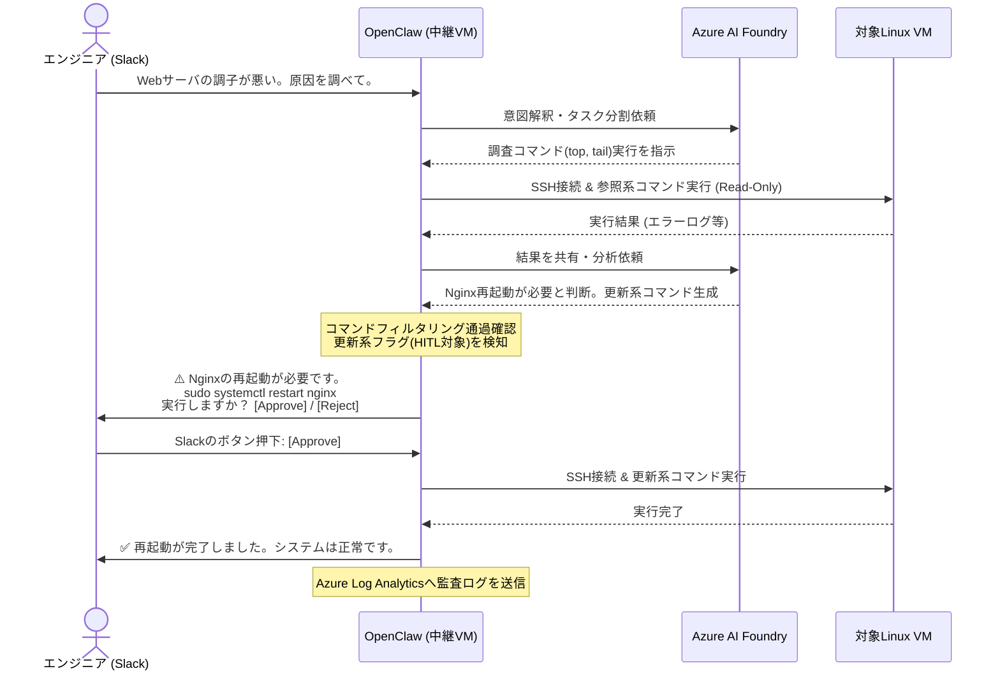

# 熟練Linuxエンジニア育成（AIエージェント化）プロジェクト 基本設計書

## 1. システム方式設計
本システムは、Azure上のIaaS（仮想マシン）およびPaaSを組み合わせて構築する。設計内容は **Bicep によるテンプレート化**を基本とし、Infrastructure as Code による自動デプロイを想定している。LLMの推論基盤として **Azure AI Foundry** を利用することで、データガバナンスを確保しつつ高度なAI機能を利用する。チャットインターフェースは **Slack／Teams 等のWebhook対応ツール**を想定しており、本設計ではSlackを標準とするが、API ゲートウェイ層で抽象化するため他のツールへの展開も容易である。

導入は要件定義書で示されたロードマップ（Phase 1-3）に従い、まず参照系コマンドのみを実行する Phase 1 を実装し、Phase 2 で承認制の更新機能、Phase 3 で監視アラート連携による完全自律実行へと段階的に拡張する。

### 1.1 サーバー構成（インフラストラクチャ）
OpenClawを実行する中継サーバー（Bastion）の基本リソース要件を定義する。

| 項目 | 設定方針 / 要件 | 備考 |
| :--- | :--- | :--- |
| **リージョン** | 東日本 (Japan East) | 対象Linux VMが稼働するリージョンに配置 |
| **ロール** | 中継サーバー (OpenClaw実行基盤) | |
| **OS** | Ubuntu 24.04 LTS | |
| **VMサイズ** | Standard_B2ms | 2 vCPU, 8GB RAM。Agentの処理負荷に応じてスケールアップ可能とする |
| **OSディスク** | Premium SSD 64GB | OSおよび基本パッケージ領域 |
| **データディスク** | Standard SSD 128GB | `/opt/openclaw` 配下としてマウント。<br>ログデータ、Memory(RAG)のベクトルDB、および一時的な作業領域として利用 |

### 1.2 クラウドサービス (Azure PaaS) の利用
* **Azure AI Foundry (旧 Azure AI Studio):** Claude Sonnet 4.6 モデルをModel-as-a-Service (MaaS) エンドポイントとしてデプロイし、推論エンジンとして利用する。
* **Azure Key Vault:** Azure AI Foundryのエンドポイントキー、Slack Botトークン、対象サーバーへのSSH秘密鍵を暗号化して保存。中継サーバーからは「マネージド ID」を用いて取得する。
* **Azure Log Analytics:** 中継サーバーで出力されるOpenClawの動作ログ、監査ログを収集・永続化する。

---

## 2. ネットワーク・セキュリティ設計
中継サーバーを起点としたセキュアな通信を実現するため、Azure Virtual Network (VNet) および Network Security Group (NSG) のルールを定義する。

### 2.1 ネットワーク通信フロー・NSG設計図



### 2.2 通信要件 (NSGルール設定方針)
* **管理用NSG (`NSG_Mgmt`):**
  * Inbound: SlackからのWebhook (TCP 443) および運用拠点からのSSH (TCP 22) のみ許可。それ以外はDeny。
  * Outbound: Azure AI Foundry、Key Vault、Log Analytics、およびSlack APIへのHTTPS (TCP 443) 通信を許可。VNet内部の対象サブネットへのSSH (TCP 22) を許可。
* **対象用NSG (`NSG_Target`):**
  * Inbound: 中継サーバー (OpenClaw VM) からのSSH (TCP 22) **のみ**を追加で許可（既存の業務通信ルールは維持）。

---

## 3. ソフトウェア・コンポーネント設計 (OpenClaw)
中継サーバー上に配置するOpenClawの内部アーキテクチャおよび主要コンポーネントを設計する。

### 3.1 ディレクトリ・ファイル構成
データディスク領域に配置し、以下のファイル群で制御する。これらはGitでバージョン管理される。

```text
/opt/openclaw/   # ※データディスクをマウントする領域
 ├── config/
 │    └── settings.yaml       # AI Foundryエンドポイント、Slack連携設定、タイムアウト値
 ├── inventory/               # 対象VMのインベントリ管理
 │    └── targets.yaml        # 追加したVMのIP/ホスト名を列挙。エージェントはこのファイルを参照して操作対象を認識する
 ├── prompts/
 │    ├── system_prompt.md    # 熟練Linuxエンジニアとしてのペルソナ、基本原則
 │    └── guardrails.md       # 絶対に実行してはいけないルールの自然言語定義
 ├── skills/                  # 機能モジュール群
 │    ├── ssh_executor.py     # 対象VMへのSSH接続・コマンド実行用Skill
 │    └── log_parser.py       # ログファイルからエラー行を抽出・要約するSkill
 └── core/
      ├── hitl_manager.py     # Slackでの承認(Approve/Reject)制御ロジック
      └── command_filter.py   # 実行直前のブラックリスト(正規表現)照合ロジック
```

### 3.2 実行権限・OSレイヤーの安全設計（最小権限の原則）
対象VM側で、AIエージェントがSSH接続した際のリスクを最小化する。
1. **専用ユーザーの作成:** 対象VMに `ai_agent` ユーザーを作成する。
2. **sudo 権限の厳格化 (`visudo`):** 更新系コマンドが必要な場合は、パスワードなしで実行可能なコマンドをホワイトリスト化する。
   * *(設定例)* `ai_agent ALL=(ALL) NOPASSWD: /bin/systemctl restart nginx, /bin/systemctl restart mysql`

### 3.3 コマンドフィルタリング (ガードレール機能)
OpenClawの `command_filter.py` にて、SSH実行直前に以下の正規表現ブラックリストを用いた検証を行う。該当した場合はAIに「実行不可」のエラーを返し、代替案を考えさせる。
* ブロック対象例: `rm\s+-rf.*`, `mkfs.*`, `fdisk.*`, `reboot`, `shutdown`, `iptables.*` 等

---

## 4. 処理フロー連携設計 (Human-in-the-Loop)
システムに影響を与える「更新系コマンド」をAIが提案した場合の、Slackを介した人間による承認プロセスのシーケンスを定義する。

### 4.1 HITL (人間承認) シーケンス図



---

## 5. 運用・保守・監視設計
### 5.1 監査ログ (Audit Trail) の管理
OpenClawの動作は、すべて構造化ログ (JSON形式) として出力し、Log Analyticsエージェント等を介して **Azure Log Analytics** へ転送する。
* **記録項目:** タイムスタンプ、トリガー元 (Slack ID/アラート)、使用したSkill、実行先VM名、実行したコマンド、標準出力/エラー出力、HITLの承認者。
* **API障害時のフェールセーフ:** LLM API（Claude）やWebhookゲートウェイとの通信が失敗した場合も、エラーメッセージを構造化ログに記録し、ユーザーへは明確に通知することで安全に処理を中断できる仕様とする。

### 5.2 システムの死活監視・異常検知
* 中継サーバー自体のリソース（CPU/ディスク空き容量）およびOpenClawプロセスの死活監視をAzure Monitorで実施。
* Azure AI Foundryのエラー（HTTP 429 / 5xx）が規定回数連続した場合、運用チームのSlackチャンネルへ緊急アラートを発報する。